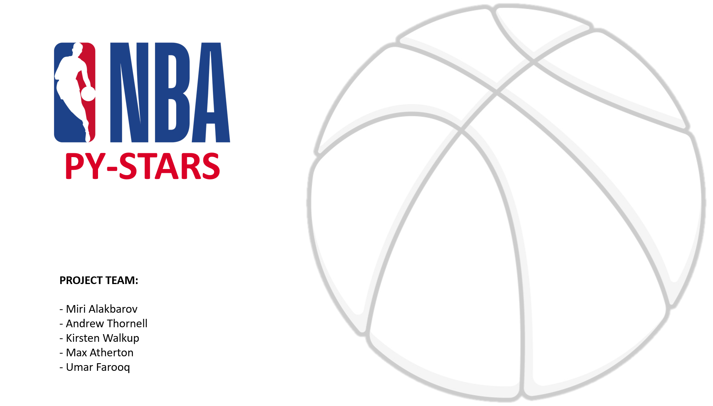
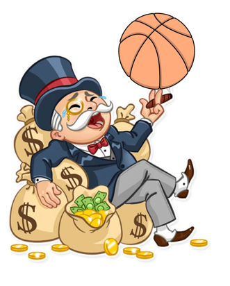

# Project1

## Project DESCRIPTION

It all started when a group of 5 hotshots were hired by Mr. Drake Romaro, a billionaire who made his fortune from betting on sports. While his initial bets were lucky hoops, which made him a fortune, now he thinks he needs to develop a calculated wining strategy.
Mr. Romaro has started his own analytics company to analyze the 2019 – 2020 basketball season data predicted the winning team. He has recently asked fresh graduates from UT Austin Data Camp to help him win big this season.

#### WILL THIS NEW TEAM BE ABLE TO MAKE THE ACCURATE PREDICTION? LETS FIND OUT!

## Research QUESTIONS TO ANSWER

* Q.1. Which are the top 8 teams for each conference in the current season, till the last data point? What are the scores of the top 8 teams? And their win to loss ratio. For each conference.
* Q.2. Does the home team win more or the visitors team win more matches?
* Q.3. What are the locations of the game? Heat map indicators of teams with more wins.
* Q.4. Calculating correlation between team player stats, team field goal % and other variables against games won by the team.
* Q.5. Defining winning parameters to determine a score for “Win Factor” of each team.

## Breakdown OF TASKS

* Importing and merging relevant data files. 
* Create data frame of top 8 teams and their respective win/loss scores and ratio.
* Make a bar graph with wins in green and losses in red.
* Calculate the number of win counts by home team and visitors team, and represent them in a pie chart.
* Use Google API to match venue location and extract their latitude and longitude. Map game location on Google Maps.
* Heat map indicators of teams with more wins percentage.
* Extract player points and average their data in new data frame. Sum all the team’s player data and match them to their respective team. 
* Calculating correlation between team player stats and game won by the team.
* Make scatter plots of Team Win vs. Player Stats and other variables and run regression for each conference to find relationship between variables.
* Make observation as per analysis results and define winning parameters for win prediction.

## Data sources:
* https://www.kaggle.com/nathanlauga/nba-games?select=teams.csv

* https://www.mysportsfeeds.com/data-feeds/

 

### All Rights Reserved
Prensentation made by Umar Farooq, approved by Project Team.

