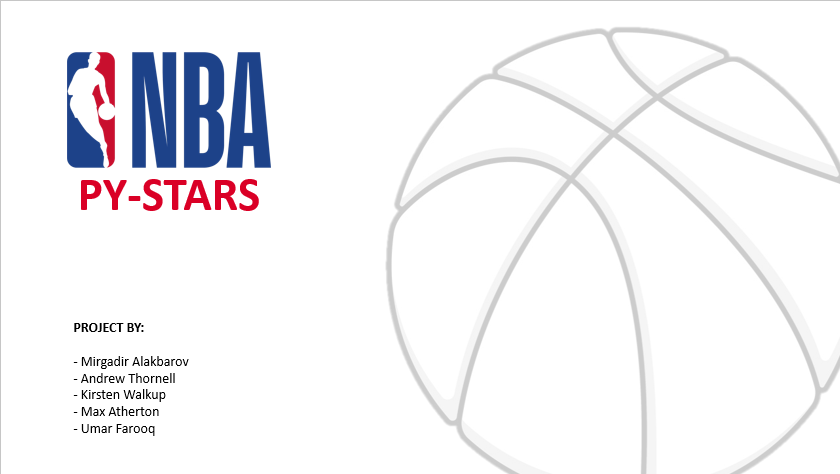

# Project1

## Project DESCRIPTION

It all started when a group of 5 hotshots were hired by Mr. Drake Romaro, a billionaire who made his fortune from betting on sports. While his initial bets were lucky hoops, which made him a fortune, now he thinks he needs to develop a calculated wining strategy.
Mr. Romaro has started his own analytics company to analyze the 2019 – 2020 basketball season data predicted the winning team. He has recently asked fresh graduates from UT Austin Data Camp to help him win big this season.

#### WILL THIS NEW TEAM BE ABLE TO MAKE THE ACCURATE PREDICTION? LETS FIND OUT!

## Research QUESTIONS TO ANSWER

* Q.1. Which are the top 8 teams for each conference in the current season, till the last data point?
* Q.2. What are the scores of the top 8 teams? And their win to loss ratio. For each conference.
* Q.3. Does the home team win more matches or the visitors team win more matches?
* Q.4. What are the locations of the game?
* Q.5. Which teams out of the top ten has better players stats? Developing a quality score for teams after aggregating the stats of team players.
* Q.6. Heat map indicators of teams with more wins. 
* Q.7. Calculating correlation between team player stats and game won by the team.
* Q.8. Defining winning parameters for win prediction.

## Breakdown OF TASKS

* Importing and merging relevant data files.
* Create data frame of top 8 teams and their respective win/loss scores and ratio.
* Calculate the number of win count by home team and visitors team and represent them in a pie chart.
* Make a bar graph with wins in green and losses in red.
* Use Google API to match venue location and extract their latitude and longitude. Map game location on Google Maps.
* Extract player points and average their data in new data frame. Sum all the teams player data and match them to their respective team.
* Heat map indicators of teams with more wins.
* Importing and merging relevant data files.
* Calculate the number of win count by home team and visitors team and represent them in a pie chart. 
* Make a bar graph with wins in green and losses in red.
* Extract player points and average their data in new data frame. Sum all the teams player data and match them to their respective team.
* Calculating correlation between team player stats and game won by the team.
* Make scatter plots of Team Win vs. Player Stats and run regression for each conference.
* Make observation as per analysis results and define winning parameters for win prediction. 

## Data sources:
* https://www.kaggle.com/nathanlauga/nba-games?select=teams.csv
* https://www.mysportsfeeds.com/data-feeds/ 

### All Rights Reserved
Prensentation made by Umar Farooq, approved by Project Team.

